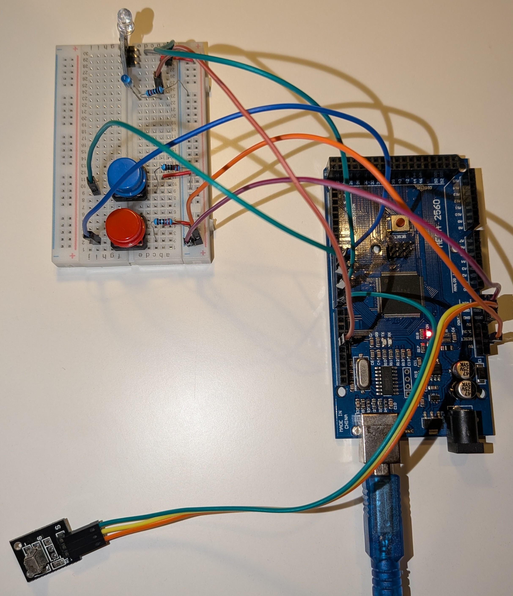

# IR signal cloner

Captures infra red signals with a IR receiver, stores the signal, sends it with an IR emitter. 

Use a button to record the signal and another button to then send that stored signal.

LED indicator while signal is being recorded.

## Signals

```
RECEIVING: DC23FB04
Protocol=NEC Address=0x4, Command=0x23, Raw-Data=0xDC23FB04, 32 bits, LSB first, Gap=528150us, Duration=66700us
Send with: IrSender.sendNEC(0x4, 0x23, <numberOfRepeats>);
```

```
SENDING: DC23FB04
Protocol=NEC Address=0x4 Command=0x23 Raw-Data=0xDC23FB04 32 bits LSB first Gap=528150us
```

## Wiring/demo



## Prerequisites

- IRremote library